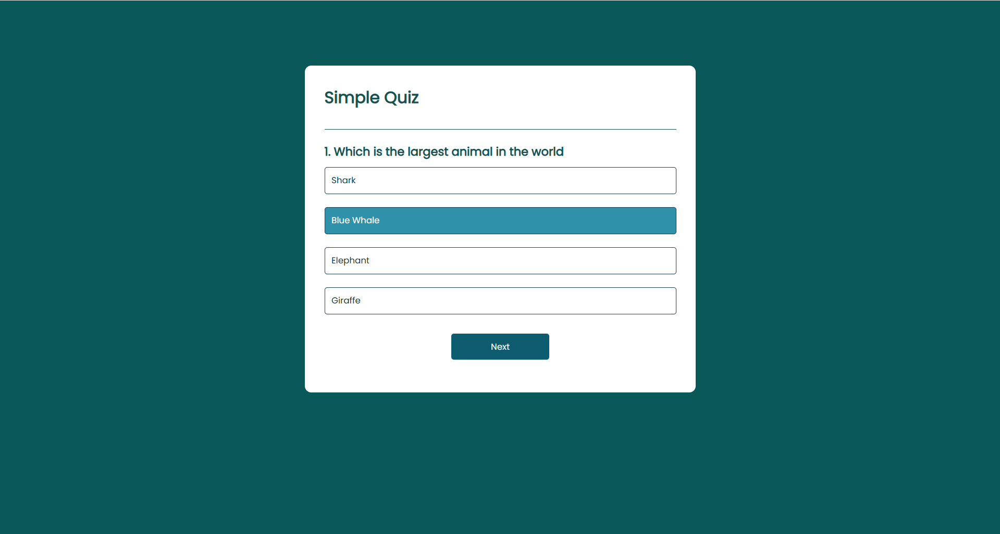
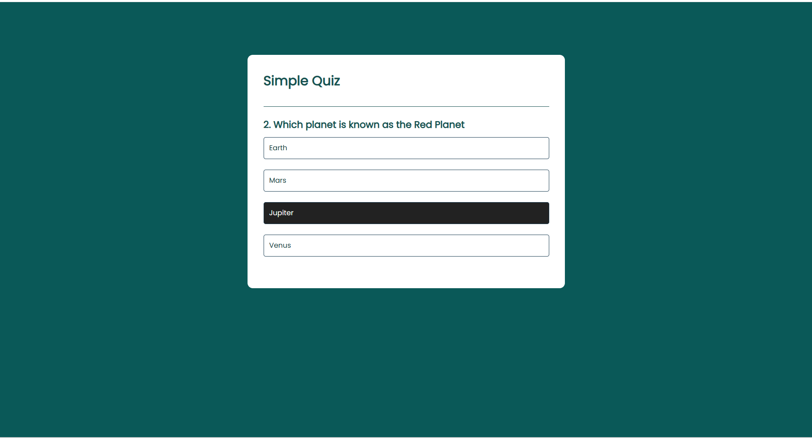
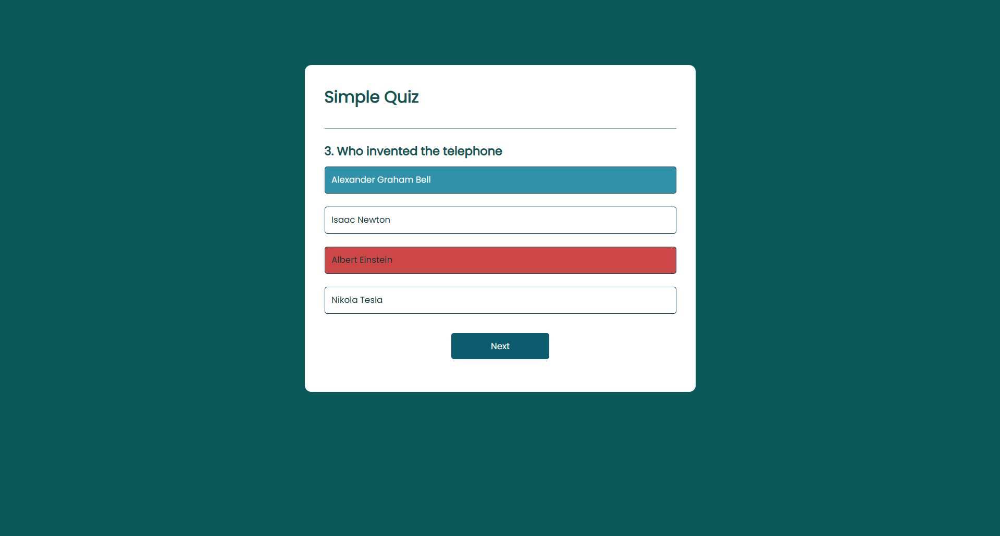

# 🧠 Simple Quiz App

A beginner-friendly **JavaScript Quiz Application** that displays multiple-choice questions, checks answers, and shows the final score.

This project was built to strengthen my understanding of core JavaScript concepts such as DOM manipulation, event handling, and program flow.

## 🚀 Features
* Multiple choice questions
* Dynamic question rendering
* Instant answer validation
* Score tracking system
* Next question navigation
* Final result display

## 🛠️ Technologies Used
* HTML5
* CSS3
* JavaScript (Vanilla JS)

## 📂 Project Structure```
quiz-app/
* │
* ├── index.html        → App structure
* ├── style.css         → UI styling
* ├── script.js         → Quiz logic
* └── screenshots/
      └── quiz1.png
      └── quiz2.png
      └── quiz3.png

## 📸 Screenshots
```



```

## ▶️ How to Run the Project
1️⃣ Clone the repository

```
git clone https://github.com/takundagorogodo/quiz-app.git
```

2️⃣ Open the folder in VS Code

3️⃣ Run `index.html` using Live Server
OR open it directly in your browser

## 🧩 Program Flow
1. Questions stored in an array of objects
2. Quiz starts from Question 1
3. User selects an answer
4. Correct answer is highlighted
5. Score updates automatically
6. Next question loads
7. Final score is displayed
   
## 📚 Learning Outcomes
Through this project I learned:
* DOM Manipulation
* Creating dynamic buttons
* Handling click events
* Using arrays & objects
* Managing application state
* Building interactive UI

## ✍️ Author

**Takunda Gorogodo**

GitHub: https://github.com/takundagorogodo

## ⭐ Support

If you like this project, consider giving it a ⭐ on GitHub — it helps a lot!
